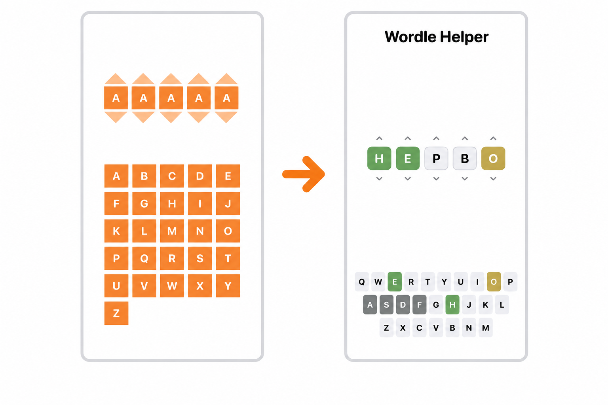

# WordleHelper

Just a simple app concept that can potentially help with Wordle.
View37 is the base view on the left. View38 is the improved/clean UI that was redesigned by claude.

Tasks:

- [ ] Add button for a random word generator that takes into account correct characters, correct character placement, and excluded letters.
